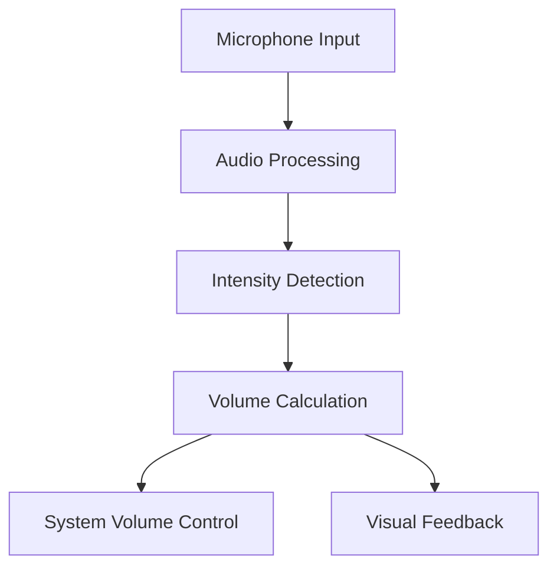

# Voice-Controlled Volume Adjuster 🎯

## Basic Details
### Team Name: KrazyPitz
### Team Members
- Team Lead: Daniel Suresh - CUSAT
- Member 2: Sreeram P - CUSAT
- Member 3: Niju Roy - CUSAT

### Project Description
A voice-controlled application that turns your music up or down based on how loudly you yell at it! The app uses real-time audio processing to detect voice intensity and adjusts system volume accordingly.

### The Problem (that doesn't exist)
Control your volume by yelling—because who needs buttons when you have lungs? In a world where touching volume controls is just too mainstream, we bring you the solution nobody knew they needed!

### The Solution (that nobody asked for)
An app that adjusts your device's volume based on how loudly you yell—perfect for those moments when your voice needs to be heard... by your speakers! Features include:
- Real-time voice intensity detection
- Dynamic volume adjustment
- Visual feedback with live graphs
- Calibration system for different environments
- Cross-platform compatibility

## Technical Details
### Technologies/Components Used
For Software:
- Languages: Python 3.8+
- Frameworks: 
  - tkinter (GUI)
  - sounddevice (Audio processing)
  - numpy (Numerical computations)
- Libraries:
  - matplotlib (Visualization)
  - pygame (Audio feedback)
  - pycaw (Windows audio control)
  - comtypes (Windows system integration)
- Tools:
  - Visual Studio Code
  - Git/GitHub

### Implementation
#### Installation
```bash
# Clone the repository
git clone https://github.com/iamdanielsuresh/useless_project.git

# Navigate to project directory
cd VOICECONTROL

# Install required packages
pip install -r requirements.txt
```

#### Run
```bash
# Start the application
python main.py
```

### Project Documentation
#### Screenshots

*Main application interface showing volume controls and real-time visualization*


*Calibration window where users can adjust sensitivity and audio thresholds*


*Live monitoring interface showing intensity levels and volume adjustment*

#### Diagrams

*Application workflow showing audio processing pipeline and volume control system*



### Project Demo
#### Video
[Voice Volume Controller Demo](https://youtu.be/your-demo-video)
*Demonstrates the application's core features including:*
- Real-time voice detection
- Volume adjustment response
- Calibration process
- Different visualization modes

## Team Contributions
- Daniel Suresh: 
  - Project architecture
  - Core audio processing implementation
  - Performance optimization
- Sreeram P:
  - GUI development
  - Visualization components
  - Documentation
- Niju Roy:
  - Cross-platform compatibility
  - Testing and debugging
  - Windows volume control integration

## Features and Capabilities
- Real-time audio intensity monitoring
- Customizable sensitivity settings
- Multiple visualization modes (Line Graph, Bar Graph, Meter)
- System volume integration for Windows, macOS, and Linux
- Noise floor detection and filtering
- User-friendly calibration process
- Performance optimization for minimal latency
- Configurable audio feedback

## Known Limitations
- May require recalibration in different noise environments
- Brief latency during initial startup
- System volume control requires appropriate permissions
- Performance may vary based on system specifications

---
Made with ❤️ at TinkerHub Useless Projects


